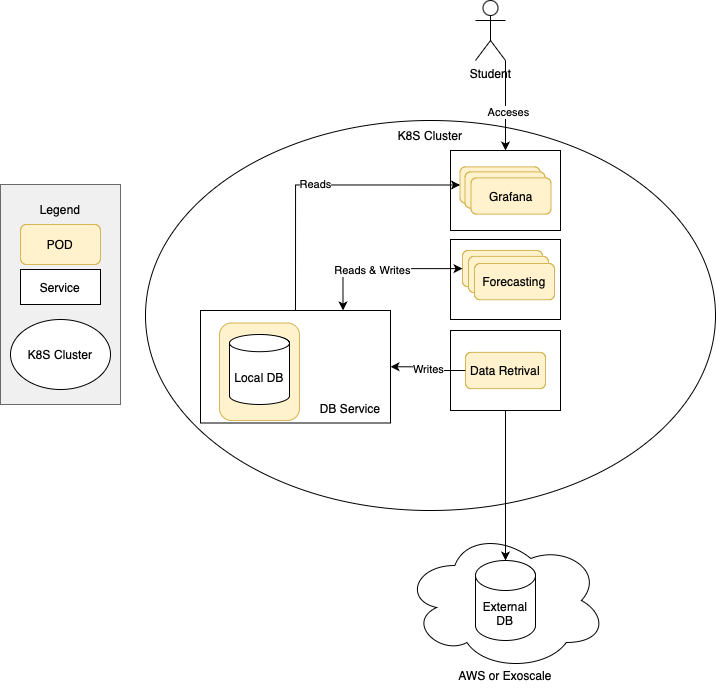

# K8S-Lab

## GOAL

In this exercise, students will deploy a Kubernetes cluster locally to manage an application that retrieves and stores electrical consumption data, forecasts future consumption, and presents both historical and projected consumption trends.

The electrical consumption is reprsented by a a CSV file stored on S3. This CSV file has 11 columns. The first column is the time stamp. The other ten columns each represent the power measurements (P) of a smart meter's electricity consumption. Measurements are taken every 15 minutes. A row in the CSV file therefore corresponds to the power measurement at a given time t (HH:00, HH:15, HH:30. HH:45) for the 10 smart meters. The measures cover the period 01.01.2021 - 31.05.2022.

The application will be deployed on a local kubernetes cluster created using the [kind] (https://kind.sigs.k8s.io/) tool.

## Kind

Kind (Kubernetes in Docker) is a tool designed to facilitate the running of local Kubernetes clusters using Docker containers as nodes.  It simplifies the process of setting up a Kubernetes cluster by eliminating the need for virtual machines or cloud infrastructure, making it accessible and efficient for developers and testers. With kind, clusters can be created, managed, and deleted using straightforward commands, allowing for quick iterations and experiments. Its flexibility supports multi-node clusters, enabling realistic testing scenarios and the development of distributed applications in an environment closely resembling production. For further detail you can read this [web site](https://kind.sigs.k8s.io/).

## The application

The application to deploy is composed of 4 modules: Data Retrieval, Forecast, Redis and Grafana. The figure below describes how these 4 modules interact and how they are deployed.



### Data Retrieval

Data Retrieval is a Python program that reads the S3 bucket where the CSV file is stored. It then writes the data into a Redis database. **This program is run only once to ingest data into the system**. It reads the 10 devices (smart meters) electrical consumption from the CSV and inserts them into Redis as a RedisTimeSeries dataset. It also creates a Redis Queue with Device ID, which is used to retrieve from the RedisTimeSeries  (if possible, it sets a key-value structure in the queue [id, RedisTimeSeries]).

### Forecast

Based on the data provided, forecasts X amounts of days in the future. It utilizes LSTM to forecast based on historical data from Groupe E. It will create as many instances as devices in the database (in this case, it will be capped at 10 instances/devices). Every minute, it will forecast the following day, storing the result in the database as a RedisTimeSeries.

### Redis

Redis is an in-memory database largely used as a cache. In this case, we’ll use a document store to store historical and forecasted data. It is replicated and provides an automated way to replicate data across instances. 

### Grafana

Grafana is an analytics visualization platform which will be used to visualize the historical and forecasted data being processed. It connects to Redis and displays the RedisTimeSeries as a line graph, showing passed and future power consumption.

## Setup
1. Clone this repository and create an account on [Docker Hub](https://hub.docker.com).
2. Install [Docker](https://docs.docker.com/engine/install/) and [Kind](https://kind.sigs.k8s.io/docs/user/quick-start/). If you are installing Kind on Mac, use brew tool: brew install kind. The Installation instructions on MacOS available on [this page](https://kind.sigs.k8s.io/docs/user/quick-start/#installing-from-release-binaries) do not work. 
4. Create a [Kind configuration file](https://kind.sigs.k8s.io/docs/user/quick-start/#multi-node-clusters) composed of one control-plane node, and 5 worker nodes
5. Create a cluster using the configuration file
6. Setup kubectl - the default Kubernetes CLI tool - [to interact with the Kind Cluster](https://kind.sigs.k8s.io/docs/user/quick-start/#interacting-with-your-cluster).

Kind will create a cluster by deploying a docker container for each node in the cluster. Each container will have a kubernetes runtime, and kind will setup the required networking to make the cluster work.

At this point, you should be able visualize your cluster by running:

```bash
docker ps
```

The output should be something similar to:
```bash
CONTAINER ID   IMAGE                           COMMAND                  CREATED       STATUS       PORTS                       NAMES
16f273bb6081   kindest/node:v1.31.0            "/usr/local/bin/entr…"   4 hours ago   Up 4 hours                               kind-worker4
ac54f2f5d5b1   kindest/node:v1.31.0            "/usr/local/bin/entr…"   4 hours ago   Up 4 hours   127.0.0.1:64379->6443/tcp   kind-control-plane
dad309f973d4   kindest/node:v1.31.0            "/usr/local/bin/entr…"   4 hours ago   Up 4 hours                               kind-worker5
b2de27161ffa   kindest/node:v1.31.0            "/usr/local/bin/entr…"   4 hours ago   Up 4 hours                               kind-worker3
4ede6be6659c   kindest/node:v1.31.0            "/usr/local/bin/entr…"   4 hours ago   Up 4 hours                               kind-worker
f4a46caed4f2   kindest/node:v1.31.0            "/usr/local/bin/entr…"   4 hours ago   Up 4 hours                               kind-worker2
```

You can see the control-plane and worker nodes. Now, by doing `kubectl get all` you should get an output similar to:

```bash
NAME                 TYPE        CLUSTER-IP   EXTERNAL-IP   PORT(S)   AGE
service/kubernetes   ClusterIP   10.96.0.1    <none>        443/TCP   3h37m
```

You are ready to deploy services to your cluster.

## Deployment Files

Kubernetes services can be deployed using Deployment Files, `YAML` files that describe how and where a service should be deployed. In this repositiory you have a folder called `deployment` which has the following structure:
```bash
|- deployment/
|---- data-retreival/
|---- forcast/
|---- data-retrieval-deployment.yaml
|---- forecast-deployment.yaml
|---- grafana-deployment.yaml
|---- redis-deployment.yaml
```

The yaml files are incomplete and need to be completed before any deployments.

Both the `data-retrieval` and `forecast` folders have the following structure:

```bash
|- data-retrieval/
|---- main.py
|---- requirements.txt
|---- Dockerfile
```

## Tasks

### Task 1: Redis deployment

1. Fill the redis-deployment.yaml
2. Dploy the redis module using kubectl.

### Task 2: Data Retrieval deployment

The data-retrieval module must access the S3 object storage to read the CSV file containing the electrical consumption. You must therfore use the AWS Acess key and secret key. We use "secrets" to propagate confidential data through the cluster. Read the data-retrieval-deployment.yaml carefully and spot the name of the secrets used. The secrets must be generated by the following command:

```bash
kubectl create secret generic <name-of-the-secrets> \
  --from-literal=AWS_ACCESS_KEY_ID=<Your access key> \
  --from-literal=AWS_SECRET_ACCESS_KEY=<your secret key>
```
1. Build the Data Retrieval docker and push it to your dockerhub account
2. complete the file "data-retrieval-deployment.yaml"
3. Deploy the data-retrieval module using kubectl

### Task 3: Forecast deployment

1. Build the container and push it to your dockerhub account
2. Fill the forecast-deployment.yaml
3. Deploy the forecast module using kubectl. Keep in mind tha data-retrieval deployment must finish its execution before deploying the forecast module. Use "kubectl logs" to ensure that the data-retrieval module has finished.

### Task 4: Grafana deployment

Fill the grafane-deployment.yaml and deploy.

### Task 5: Load Balancer

Kubernetes provides Load Balancing capabilities natively. This permits the distribution of load between several replicas of the same pod. But, as we are deploying using kind, to access this ability we have to create a port-forward between the service and the host device:

```bash
kubectl port-forward service/grafana-service 3000:3000
```

In this case we only require one port forward, between the grafana service (the frontend to this service), and the host. Once this PF is established, we are able to access the grafana interface on `http://localhost:3000`.

## Task 6: Grafana Dashboard Configuration

Build the dashboard by copying the following photos:

Time Range:


Forecated Data:


Real Data:
