# Kubernetes Lab Report

## Autors: Jaquet Steven    Marrino Jarrin Gabriel      Ngueukam Djeuda Wilfried Karel

October 2025

Course : TSM_CloudSys

Instructors:

- White John (Teacher)
- Chebbi Abir (Assistant)

### Set up Environment

- Ensure docker is installed:
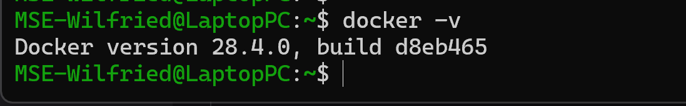

- Ensure Kind is installed
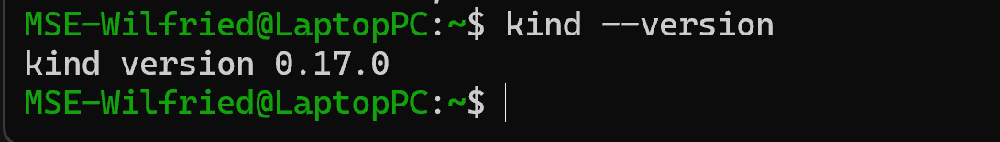

- Create the kind configuration file: We create a simple cluster configuration file containing as requested 1 control-plane and 5 workers. The contains of the file is given below:

``` yaml
kind: Cluster
apiVersion: kind.x-k8s.io/v1alpha4
nodes:
- role: control-plane
- role: worker
- role: worker
- role: worker
- role: worker
- role: worker
```

- Creating cluster: We use the following command to create our cluster:
`kind create cluster --config kind-config-cluster.yml`. As result, we are getting the following output:
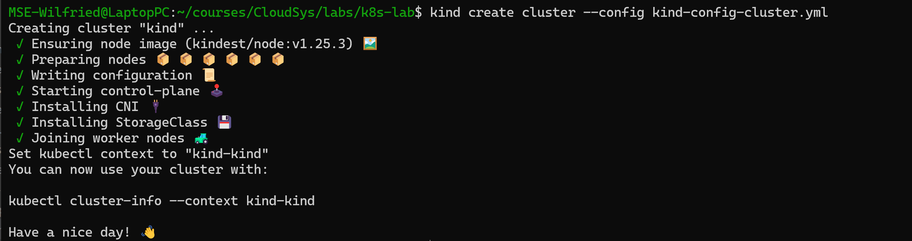
We can check our cluster is created using command `kind get clusters` and `docker ps` to list docker's containers created for our cluster.
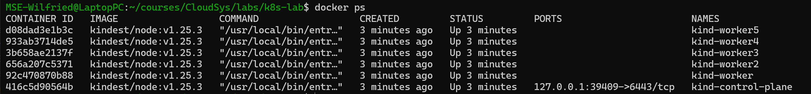

- Setting `kubectl` to use our cluster with `kubectl cluster-info --context kind-kind` since the default name for our cluster is **_kind_**
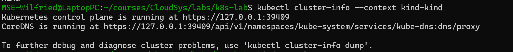

### Task 1 : Redis deployment

#### 1. complete redis-deployment.yaml file

To deploy our redis pod, we complete the _redis-deployement.yaml_ file with necessary informations. The first one is the `spec.selector.matchLabels` property. We add an `app: redis-pod` property to indicate at this deployment to manage pods with label `app: redis-pod`. We use the same logic in service configuration and add `app:redis-pod` to `spec.selector` property. This is how our file now looks like:

```yaml
...
spec:
  replicas: 1
  selector:
    matchLabels:
      app: redis-pod
...
spec:
  selector:
    app: redis-pod
  ports:
...
```

#### 2. Deployment of redis pod

We now applying our deployment with command `kubectl apply -f deployment\redis-deployment.yaml`and getting the following output:
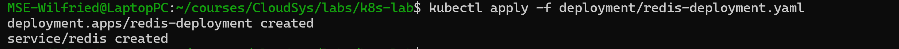

### Task 2 : Data-retrieval deployment

#### 1. Building image and push it to our dockerhub account

For this part, we browse to `deployment\data-retrieval\Dockerfile` and we executed the command `docker build -t stormit237/data-retrieval .`. After a few seconds we have executed `docker images` to check our images is created and then we make a `docker push stormit237/data-retrieval` to push our image to dockerhub. As result, on our dockerhub account, we could see the image below :
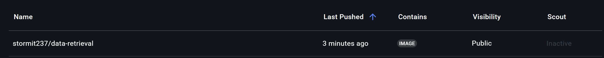

#### 2. Complete data-retrieval-deployment.yaml file

In this part, we complete missing information to deploy data-retrieval job. We had our docker image from our dockerhub account, the host of the redis services `redis.default.svc.cluster.local` our AWS_ACCESS_KEY_ID and our AWS_SECRET_ACCESS_KEY. The final file is similar to :

``` yaml

spec:
      containers:
      - name: data-retrieval
        image: stormit237/data-retrieval  # Replace with your Docker image name
        imagePullPolicy: Always        # Force the pull of the container image - used for testing purposes
        env:
        - name: REDIS_HOST
          value: redis.default.svc.cluster.local  # The host of the Redis service
        - name: AWS_ACCESS_KEY_ID
          value: "...EKYIBTQ....U6H"  # Fill in with the Secret key value
        - name: AWS_SECRET_ACCESS_KEY
          value: "...+ZOWL1xnbFVs5VQDcEX"  # Fill in with the Secret key value
      restartPolicy: Never
```

#### 3. Deploy the data-retrieval module

To deploy the data-retrieval module, we use the command `kubectl apply -f deployment\data-retrieval.deployment.yaml`. Then with the command `kubectl logs job/data-retrieval-job` we can see the process executed successfully.
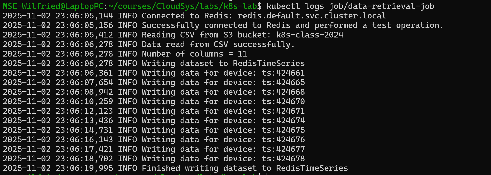

### Task 3. Forecast deployment

#### 1. Build and push container

To build container, we executed the command : `docker build -t stormit237/k8s-forecast .`. Once the command end with success, we push to our dockerhub repository using the command : `docker push stormit237/k8s-forecast`. As result we are getting the repository save to our dockerhub account :
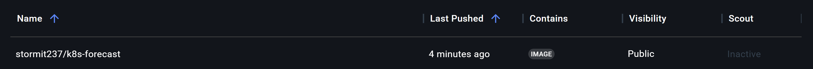

#### 2. Fill the forecast-deployment.yaml file

We complete this by providing `app: forecast-pod` as label in `template.metadata.labels`. and providing informations for the redis host `value: redis.default.svc.cluster.local`. The final file for this step looks like

``` yaml
...
 template:
    metadata:
      labels:
        app: forecast-pod  # Fill with the correct label
    spec:
      containers:
      - name: forecast
        image: stormit237/k8s-forecast:latest  # Replace with your Docker image name
        imagePullPolicy: Always        # Force the pull of the container image - used for testing purposes
        env:
        - name: REDIS_HOST
          value: redis.default.svc.cluster.local  # The host of the Redis service
...
```

#### 3. Deploy the forecast module

To deploy this module, we use command `kubectl apply -f deployment\forecast-deployment.yaml`. We then make a `kubectl get pods` to check if our command executed successfully. After a few minutes we get this output:
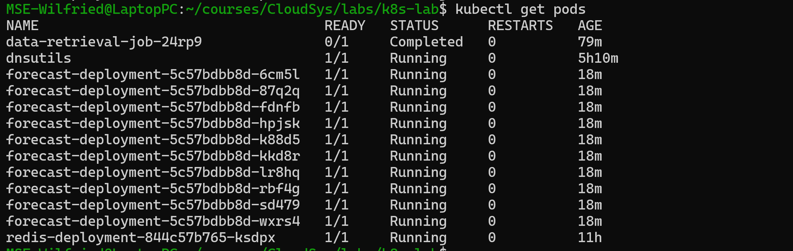
We can see we have 10 pods for the 10 replicas configured.

### Task 4. Deploy Grafana

We complete this task by providing a property `app: grafana-pod` at `spec.selector` and running command `kubectl apply -f deployment\grafana-deployment.yaml`. After a few minutes, we run command `kubectl get pods` and we get this result :
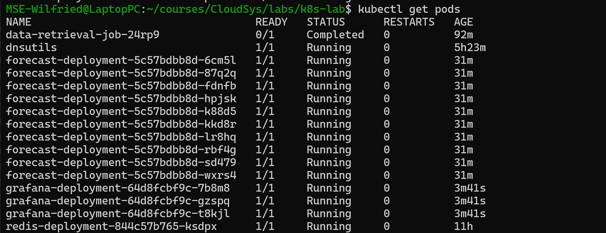
We can see on this picture 3 pods are created for grafana.

### Task 5. Load balancer

We have created a port forwarding to get access to grafana with our browser. The command we use was :
`kubectl port-forward service/grafana-service 3000:3000`. As result we are getting the following result when navigate to `localhost:3000`in our browser and login as admin :


### Task 6. Capture

From our grafana dashboard, we fill the for as represent on the two pictures and for each, we are getting following results:
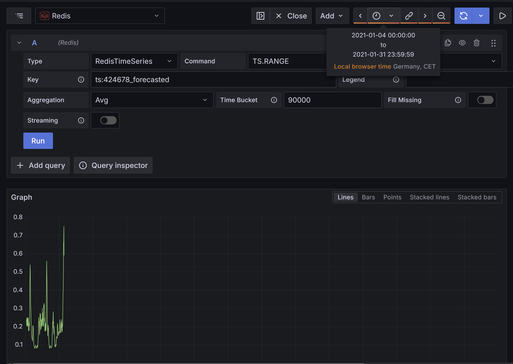

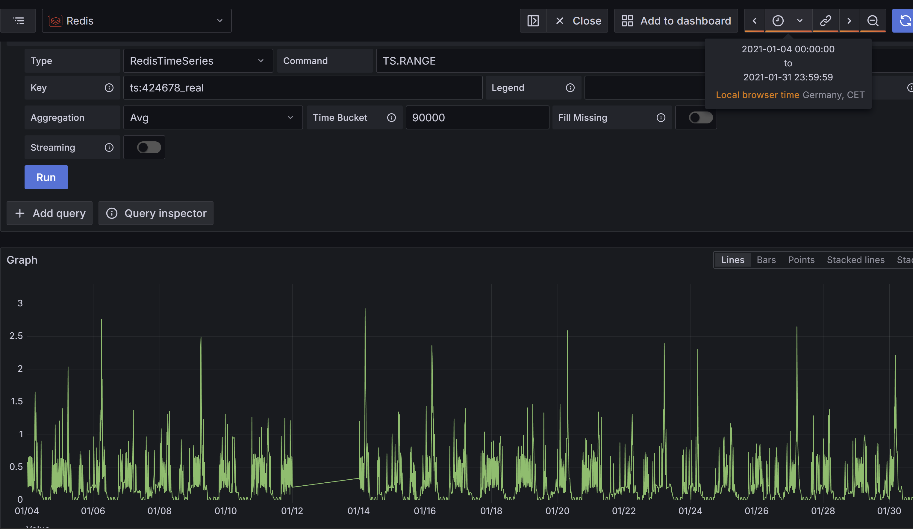
